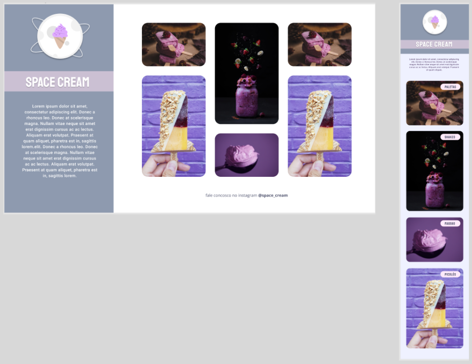

<h1 align="center"> Space Cream </h1>

  <a href="#-technologies">Technologies</a>&nbsp;&nbsp;&nbsp;|&nbsp;&nbsp;&nbsp;
  <a href="#-project">Project</a>&nbsp;&nbsp;&nbsp;|&nbsp;&nbsp;&nbsp;
  <a href="#-layout">Layout</a>

 

  

## 🚀 Technologies

This project was developed with the following technologies:

- HTML e CSS
- Git e Github

## 💻 Project

This project was developed as a two part challenge for the Stage 03 of the Explorer course from Rockesteat. The first challenge consisted in developing the mobile version, and the second challenge was to refactor the project and include the desktop design. This project was especially focused on utilizing media queries and display: grid.

You can check out the project through [THIS LINK](https://viviansanchez.github.io/rocketseat-explorer-stage03-desafio02e03//)!

## 🔖 Layout

you can check out the layout of the mobile version through [THIS LINK](https://www.figma.com/file/drBBktNRdtCIUiN4cZk4yo/Stage-03---Mobile-First/duplicate), and the desktop version through [THIS LINK](https://www.figma.com/file/pddZCuQIRLjk5dEHQ4L4YR/Stage-03---Grid-com-anima%C3%A7%C3%B5es/duplicate). It is required to have a [Figma](https://figma.com) account to access the layouts.